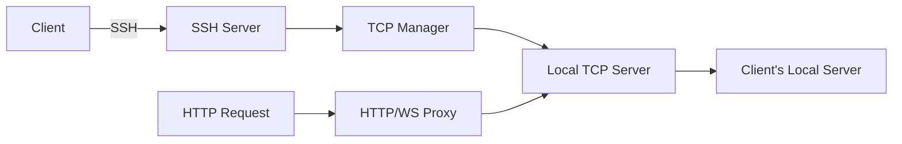

<div align="center">
  <h1>🚀 p0rt</h1>
  <p>
    <strong>Fast, secure HTTP/S tunneling service</strong><br>
    Expose your localhost to the internet instantly via SSH
  </p>
  
  <p>
    
    
    
  </p>
</div>

---

## ✨ Features

<table>
<tr>
<td>

### 🔒 **Secure by Default**
- SSH public key authentication
- HTTPS with valid certificates
- No passwords, no accounts

</td>
<td>

### ⚡ **Lightning Fast**
- Zero configuration required
- Instant tunnel creation
- WebSocket support included

</td>
</tr>
<tr>
<td>

### 🌍 **Universal Access**
- Works behind firewalls & NATs
- Custom subdomain support
- Cross-platform compatibility

</td>
<td>

### 🛠️ **Developer Friendly**
- Simple SSH command interface
- Docker & Kubernetes ready
- Open source & self-hostable

</td>
</tr>
</table>

## 🚀 Quick Start

### One-Line Tunnel

```bash
ssh -R 443:localhost:8080 p0rt.xyz
```

Your local server is now accessible at `https://[your-subdomain].p0rt.xyz` 🎉

### Custom Subdomain

```bash
# Method 1: Direct specification
ssh -R myapp:80:localhost:3000 p0rt.xyz -p 2222

# Method 2: Environment variable
ssh -R 443:localhost:3000 -o SendEnv=LC_DOMAIN -o SetEnv=LC_DOMAIN=myapp p0rt.xyz
```

## 📦 Installation

### Using Pre-built Binaries

```bash
# Download latest release
curl -L https://github.com/MeltingBot/p0rt/releases/latest/download/p0rt-linux-amd64 -o p0rt
chmod +x p0rt
./p0rt
```

### Building from Source

```bash
# Clone repository
git clone https://github.com/MeltingBot/p0rt.git
cd p0rt

# Build
go build -o p0rt ./cmd/server

# Run
./p0rt
```

### Using Docker

```bash
# Using Docker Hub
docker run -d \
  -p 2222:2222 \
  -p 80:80 \
  -p 443:443 \
  --name p0rt \
  meltingbot/p0rt:latest

# Building locally
docker build -t p0rt .
docker run -d -p 2222:2222 -p 80:80 -p 443:443 p0rt
```

### Using Docker Compose

```bash
docker-compose up -d
```

## ⚙️ Configuration

### Environment Variables

| Variable | Description | Default |
|----------|-------------|---------|
| `SSH_SERVER_PORT` | SSH server listening port | `2222` |
| `HTTP_PORT` | HTTP proxy port | `80` |
| `HTTPS_PORT` | HTTPS proxy port | `443` |
| `DOMAIN_BASE` | Base domain for tunnels | `p0rt.xyz` |
| `SSH_HOST_KEY` | SSH host private key | Auto-generated |
| `REDIS_URL` | Redis connection URL (optional) | - |
| `LOG_LEVEL` | Logging level (debug/info/warn/error) | `info` |

### Configuration File

Create a `config.yaml`:

```yaml
server:
  ssh_port: 2222
  http_port: 80
  https_port: 443
  domain: p0rt.xyz

security:
  max_connections_per_ip: 10
  rate_limit: 100
  allowed_ports: [80, 443, 3000, 8080]

redis:
  url: redis://localhost:6379
  ttl: 3600
```

## 🏗️ Architecture



### Core Components

- **SSH Server**: Handles authentication and port forwarding
- **HTTP/WebSocket Proxy**: Routes requests based on subdomain
- **TCP Manager**: Manages connection lifecycle and port allocation
- **Domain Generator**: Creates deterministic subdomains from SSH keys
- **Security Module**: Rate limiting, IP blocking, and abuse prevention

## 🔧 Advanced Usage

### Kubernetes Deployment

```yaml
apiVersion: apps/v1
kind: Deployment
metadata:
  name: p0rt
spec:
  replicas: 3
  selector:
    matchLabels:
      app: p0rt
  template:
    metadata:
      labels:
        app: p0rt
    spec:
      containers:
      - name: p0rt
        image: meltingbot/p0rt:latest
        ports:
        - containerPort: 2222
        - containerPort: 80
        - containerPort: 443
        env:
        - name: REDIS_URL
          value: redis://redis:6379
```

### Nginx Integration

```nginx
server {
    listen 80;
    server_name *.p0rt.xyz;
    
    location / {
        proxy_pass http://localhost:8080;
        proxy_set_header Host $host;
        proxy_set_header X-Real-IP $remote_addr;
        proxy_set_header X-Forwarded-For $proxy_add_x_forwarded_for;
        proxy_set_header X-Forwarded-Proto $scheme;
        
        # WebSocket support
        proxy_http_version 1.1;
        proxy_set_header Upgrade $http_upgrade;
        proxy_set_header Connection "upgrade";
    }
}
```

## 📊 Performance

- **Concurrent Connections**: 10,000+
- **Throughput**: 1 Gbps+ per tunnel
- **Latency Overhead**: < 5ms
- **Memory Usage**: ~50MB base + 1MB per connection

## 🛡️ Security

### Features

- ✅ SSH public key authentication only
- ✅ Automatic HTTPS with Let's Encrypt
- ✅ Rate limiting and DDoS protection
- ✅ IP-based connection limits
- ✅ Abuse detection and blocking
- ✅ No data logging or inspection

### Best Practices

1. **Use SSH keys**: Never share your private key
2. **Firewall rules**: Restrict SSH access to trusted IPs
3. **Monitor logs**: Watch for unusual activity
4. **Update regularly**: Keep p0rt up to date

## 🤝 Contributing

We love contributions! Please see our [Contributing Guide](CONTRIBUTING.md) for details.

```bash
# Fork and clone
git clone https://github.com/MeltingBot/p0rt.git
cd p0rt

# Create feature branch
git checkout -b feature/amazing-feature

# Make changes and test
go test ./...

# Commit and push
git commit -m "Add amazing feature"
git push origin feature/amazing-feature
```

## 📈 Roadmap

- [ ] Multi-region support
- [ ] TCP/UDP tunnel support
- [ ] Web dashboard
- [ ] API for programmatic tunnel creation
- [ ] Tunnel sharing and collaboration
- [ ] End-to-end encryption option

          

## 📄 License

This project is licensed under the MIT License - see the [LICENSE](LICENSE) file for details.

## 🙏 Acknowledgments

- Inspired by [ngrok](https://ngrok.com), [localtunnel](https://localtunnel.me), [serveo](https://serveo.net) and [skytunnel](https://github.com/skyfortress/skytunnel)
- Built with [golang.org/x/crypto/ssh](https://pkg.go.dev/golang.org/x/crypto/ssh)
- Landing page design by our amazing contributors

 <p>
          <sub><i><b>Why p0rt ?</b> It's a clever play on words - a network "port" that acts as a "portal" to your localhost, with zero configuration.
         And yes, it also means "door" in French. Open the door to your local server from anywhere! 🚪</i></sub>
          </p>

---

<div align="center">
  <p>
    <a href="https://p0rt.xyz">Website</a> •
    <a href="https://github.com/MeltingBot/p0rt/wiki">Documentation</a> •
    <a href="https://github.com/MeltingBot/p0rt/issues">Report Bug</a> •
    <a href="https://github.com/MeltingBot/p0rt/discussions">Discussions</a>
  </p>
  <p>Made with ❤️ by the p0rt team</p>
</div>