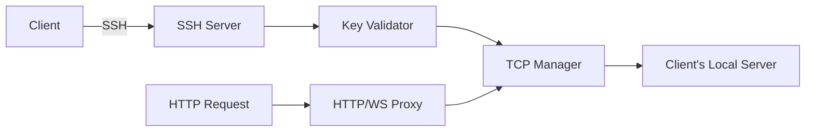

<div align="center">
  <h1>🚀 p0rt</h1>
  <p>
    <strong>Fast, secure HTTP/S tunneling service</strong><br>
    Expose your localhost to the internet instantly via SSH
  </p>
  
  <p>
    
    
    
  </p>
</div>

---

## ✨ Features

<table>
<tr>
<td>

### 🔒 **Secure by Default**
- SSH public key authentication
- HTTPS with valid certificates
- No passwords, no accounts
- SSH key allowlist for controlled access

</td>
<td>

### ⚡ **Lightning Fast**
- Zero configuration required
- Instant tunnel creation
- WebSocket support included
- < 50ms latency overhead

</td>
</tr>
<tr>
<td>

### 🌍 **Universal Access**
- Works behind firewalls & NATs
- Custom subdomain support
- Cross-platform compatibility
- Automatic key reloading

</td>
<td>

### 🛠️ **Developer Friendly**
- Simple SSH command interface
- Docker & Kubernetes ready
- Open source & self-hostable
- Interactive CLI mode

</td>
</tr>
</table>

## 🚀 Quick Start

### Development Mode

```bash
./run.sh dev
```

**Features:**
- SSH on port 2222
- HTTP on port 8080
- Open access (all SSH keys allowed)
- Perfect for testing

### Production Mode

```bash
./run.sh prod
```

**Features:**
- SSH on port 22
- HTTP on port 80
- Restricted access (SSH key allowlist)
- Docker containerized

## 📦 Installation

### Building from Source

```bash
# Clone repository
git clone https://github.com/MeltingBot/p0rt.git
cd p0rt

# Build
go build -o p0rt cmd/main/main.go

# Run development
./run.sh dev

# Run production
./run.sh prod
```

## ⚙️ Configuration

P0rt uses environment variables for configuration. For production deployment, create a `.env` file:

```bash
# Copy example configuration
cp .env.example .env

# Edit configuration
nano .env
```

### Key Configuration Options

```bash
# Server ports
SSH_SERVER_PORT=22              # SSH tunnel port
HTTP_PORT=80                    # HTTP proxy port

# Access control
P0RT_OPEN_ACCESS=false          # true=allow all keys, false=allowlist only

# Redis storage (recommended for production)
REDIS_URL=redis://redis:6379    # Enable Redis storage
REDIS_PASSWORD=                 # Redis password (if required)

# Domain configuration
DOMAIN_BASE=p0rt.xyz           # Your domain for tunnels
```

### Storage Modes

**JSON Mode (Development)**
- Leave `REDIS_URL` empty
- Data stored in local `./data/` directory
- Simple and portable

**Redis Mode (Production)**
- Set `REDIS_URL=redis://redis:6379`
- Scalable and performant
- Automatic fallback to JSON if Redis unavailable

## 🔑 SSH Key Management

P0rt supports two access modes:

### Open Access Mode (Development)
- Any SSH key can create tunnels
- Enable with: `P0RT_OPEN_ACCESS=true`
- Perfect for development and testing

### Restricted Access Mode (Production)
- Only pre-registered SSH keys allowed
- Ideal for beta programs, freemium, or VIP access
- Support for access tiers: `beta`, `free`, `premium`, `vip`

### Switching Access Modes

**Check current mode:**
```bash
./p0rt access status

# JSON output
./p0rt access status --json
```

**Switch to open access (allow all SSH keys):**
```bash
./p0rt access open

# Interactive CLI
./p0rt cli
> access open
```

**Switch to restricted access (allowlist only):**
```bash
./p0rt access restricted

# Interactive CLI  
./p0rt cli
> access restricted
```

**Note:** Mode changes apply to the current session only. To make changes permanent, update your `.env` file or environment variables.

### Managing Keys

**Add key by fingerprint (easiest):**
```bash
./p0rt -key add --key-fingerprint SHA256:abc123... --tier beta --comment "John Doe"
```

**Add key from file:**
```bash
./p0rt -key add --key-file ~/.ssh/id_rsa.pub --tier premium --comment "Jane Smith"
```

**List all keys:**
```bash
./p0rt -key list

# JSON output for scripting
./p0rt -key list --json
```

**Remove key:**
```bash
./p0rt -key remove --fingerprint SHA256:abc123...
```

**Deactivate/Activate key:**
```bash
./p0rt -key deactivate --fingerprint SHA256:abc123...
./p0rt -key activate --fingerprint SHA256:abc123...
```

### Interactive CLI

```bash
./p0rt cli
```

**Features:**
- Tab completion for all commands and subcommands
- Command history with up/down arrows
- Context-sensitive help
- Support for command aliases

Available commands:
- `key add <fingerprint> [tier] [comment]` - Add SSH key
- `key list` - List all authorized keys
- `key remove <fingerprint>` - Remove key
- `access status` - Show current access mode
- `access open` - Switch to open access mode
- `access restricted` - Switch to restricted access mode
- `server` - Start server
- `stats` - Show statistics
- `help` - Show all commands

### JSON Output for Scripting

All CLI commands support JSON output for automation and scripting:

```bash
# Get reservation data in JSON format
./p0rt reservation list --json

# Get system statistics as JSON
./p0rt cli --json
> stats

# Get SSH keys as structured data
./p0rt cli --json
> key list

# Check and change access mode
./p0rt access status --json
./p0rt access open --json

# Example: Extract domain names from reservations
./p0rt reservation list --json | jq -r '.data[].domain'
```

**JSON Response Format:**
```json
{
  "success": true,
  "message": "Operation description",
  "data": { /* structured data */ }
}
```

Use the `--json` or `-j` flag with any command to enable JSON output.

## 🌐 Creating Tunnels

### Basic Tunnel

```bash
ssh -R 443:localhost:8080 p0rt.xyz
```

Your app at `http://localhost:8080` is now available at `https://[generated-subdomain].p0rt.xyz`

### Custom Subdomain

```bash
# Method 1: Direct specification
ssh -R myapp:443:localhost:3000 p0rt.xyz

# Method 2: Environment variable
ssh -o SendEnv=LC_DOMAIN -o SetEnv=LC_DOMAIN=myapp -R 443:localhost:3000 p0rt.xyz
```

Your app is now at `https://myapp.p0rt.xyz`

### Multiple Ports

```bash
# Expose both HTTP and a custom port
ssh -R 443:localhost:3000 -R 8080:localhost:8080 p0rt.xyz
```

## 🐳 Docker Deployment

### Production with Docker Compose

```bash
# Start production server
./run.sh prod

# Add your SSH key
docker exec p0rt ./p0rt -key add --key-fingerprint SHA256:your_key --tier beta

# View logs
docker logs -f p0rt

# Interactive CLI in Docker
docker exec -it p0rt ./p0rt -cli
```

### Environment Variables

| Variable | Description | Default |
|----------|-------------|---------|
| `P0RT_OPEN_ACCESS` | Allow any SSH key | `false` |
| `SSH_SERVER_PORT` | SSH server port | `22` |
| `HTTP_PORT` | HTTP server port | `80` |
| `P0RT_AUTHORIZED_KEYS` | Path to authorized keys JSON | `authorized_keys.json` |

## 🏗️ Architecture



### Core Components

- **SSH Server**: Handles authentication and port forwarding
- **Key Store**: Manages SSH key allowlist with auto-reload
- **HTTP/WebSocket Proxy**: Routes requests based on subdomain
- **TCP Manager**: Manages connection lifecycle
- **Domain Generator**: Creates deterministic subdomains
- **Security Module**: Rate limiting and abuse prevention

## 📊 Performance

- **Concurrent Connections**: 10,000+
- **Throughput**: 1 Gbps+ per tunnel
- **Latency Overhead**: < 50ms
- **Memory Usage**: ~50MB base + 1MB per connection
- **Key Reload**: Automatic, no restart needed

## 🛡️ Security Features

- ✅ SSH public key authentication only
- ✅ Automatic HTTPS with valid certificates
- ✅ Rate limiting and DDoS protection
- ✅ IP-based connection limits
- ✅ **Advanced abuse reporting system** with domain banning
- ✅ **HTTP traceability headers** for security auditing
- ✅ SSH key allowlist with tiers
- ✅ Automatic key expiration support
- ✅ **Forensic tracking** via SSH fingerprints and source IPs

## 📈 Monitoring

**View statistics:**
```bash
./p0rt -cli
> stats
```

**Check server status:**
```bash
./p0rt -cli
> status
```

**Security events:**
```bash
./p0rt -cli
> security
```

## 🚨 Anti-Abuse System

P0rt includes a comprehensive abuse reporting and prevention system to protect users and maintain service quality:

### 📝 Abuse Reporting
- **Public reporting endpoint**: Users can report malicious domains via `/report-abuse`
- **Automated review process**: Reports are processed by administrators
- **Domain banning**: Abusive domains are blocked with custom 403 pages
- **Appeal system**: False positives can be appealed through support

### 🔍 Traceability & Security Headers

Every HTTP response includes forensic headers for security tracking:

```http
X-P0rt-Fingerprint: SHA256:abc123...def  # SSH public key fingerprint
X-P0rt-Origin: 192.168.1.100             # SSH client IP address
```

**Use cases:**
- **Abuse investigation**: Link HTTP requests to specific SSH users
- **Security auditing**: Track request origins and authentication
- **Incident response**: Forensic analysis of malicious activity
- **Compliance**: Meet traceability requirements for enterprise use

### 🛡️ Protection Features
- **IP banning**: Automatic blocking of malicious sources
- **Rate limiting**: Prevents brute force and spam attacks
- **Domain filtering**: Real-time blocking of reported domains
- **Analytics**: Security statistics and monitoring

### 🌐 Web Admin Interface

P0rt includes a modern web-based administration interface:

**Features:**
- Real-time dashboard with live metrics
- Active connection monitoring with traffic stats
- Domain reservation management
- Security monitoring and IP ban management
- Abuse report processing
- SSH key management
- Dark/light theme toggle

**Configuration:**
```bash
# Required: Enable admin interface
export ADMIN_URL="/your-secret-admin-path"
export API_KEY="your-secure-api-key"

# Start server
./p0rt server start
```

**Access:** Navigate to `http://localhost:8080{ADMIN_URL}` (secure the URL!)

> **Security Note:** The admin interface is disabled by default. Only enable it by setting `ADMIN_URL` in production, and use a hard-to-guess path like `/admin-$(date +%s)`.

### 📊 CLI Admin Commands
```bash
# List abuse reports
./p0rt abuse list

# Process reports (ban/accept)
./p0rt abuse process [report-id] [ban|accept]

# View security statistics
./p0rt security
```

## 🤝 Contributing

We welcome contributions! Please:

1. Fork the repository
2. Create a feature branch
3. Make your changes
4. Test thoroughly
5. Submit a pull request

## 📄 License

This project is licensed under the MIT License - see the [LICENSE](LICENSE) file.

---

<div align="center">
  <p>
    <a href="https://p0rt.xyz">Website</a> •
    <a href="https://github.com/MeltingBot/p0rt">GitHub</a> •
    <a href="https://github.com/MeltingBot/p0rt/issues">Issues</a>
  </p>
  <p>Made with ❤️ by the p0rt team</p>
</div>